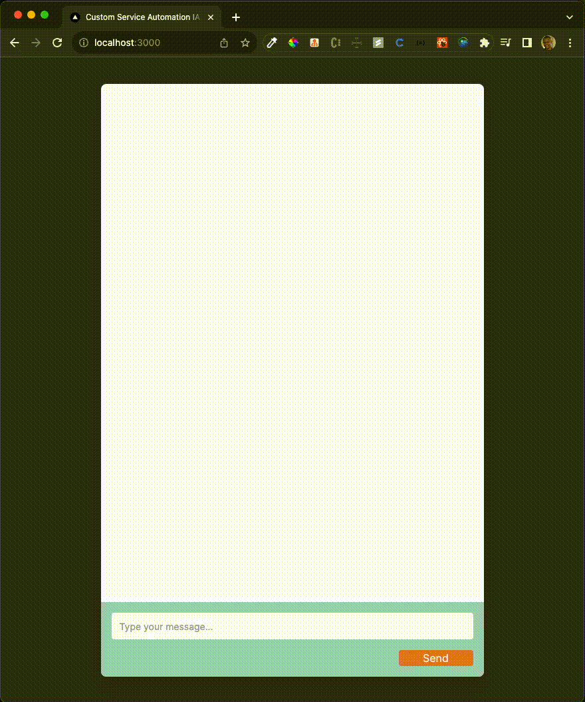

# Ai Chatbot Frontend Job Challenge

This project aims to demonstrate my skills as a full-stack developer in an AI-powered chatbot for an open role for a company that uses AI to create awesome solutions. This part of the challenge intends to test my frontend skills
about can turning layout into a functional code. The color pallet I use the on on the challenge's pdf, I hope you enjoy it.

## Tech Stack
* [Technologies](#technologies)
* [In Action App](#in-action-app)
* [Project Structure](#project-structure)
* [How to Run the Project](#run-project)
* [Last Words](#last-words)

## Technologies
This project uses:
* React/Next: v18.16.0
* TypeScript: 5.2.2 version
* Axios: 8.48.0 version
* Tailwind CSS: 3.3.3 version

## In Action App

Bellow there is a snick peak of the front end in action. The questions are sent to the backend through node REST API, then the backend make the AI API request and sends the answer to the frontend. In case of a request or other failure to the backend, there an error handler implemented at the frontend to warn the user. 

<span align="center">
  
</span>

## Project Structure<br>

It's a good practice in a frontend project to make components that could be used more often, separated components. So the project has a folder that stores all the  application's components. In large projects is good to separate the interfaces used to type the variables in one single place, then I made it too as well I separated the API connection config into its own folder too.<br>
## How to Run the Project
To run the project after make the github clone, access the project folder and inside type:

```bash 
npm install

#or

yarn
``` 
to install all project's needed dependencies.

then type<br>
```bash
npm run dev
```
to run the project. To access the link of the project just go to your browser and type `http://localhost:3000`

## Last Words

I just wanna say tank you for the opportunity to show my skills to the company, for the interview process, one of the bests that I have participating lately very kind and attention people with my person. <br>

I hope you like this project, because I put much effort on it. Was pretty challenge and fun make something using AI and other techs.